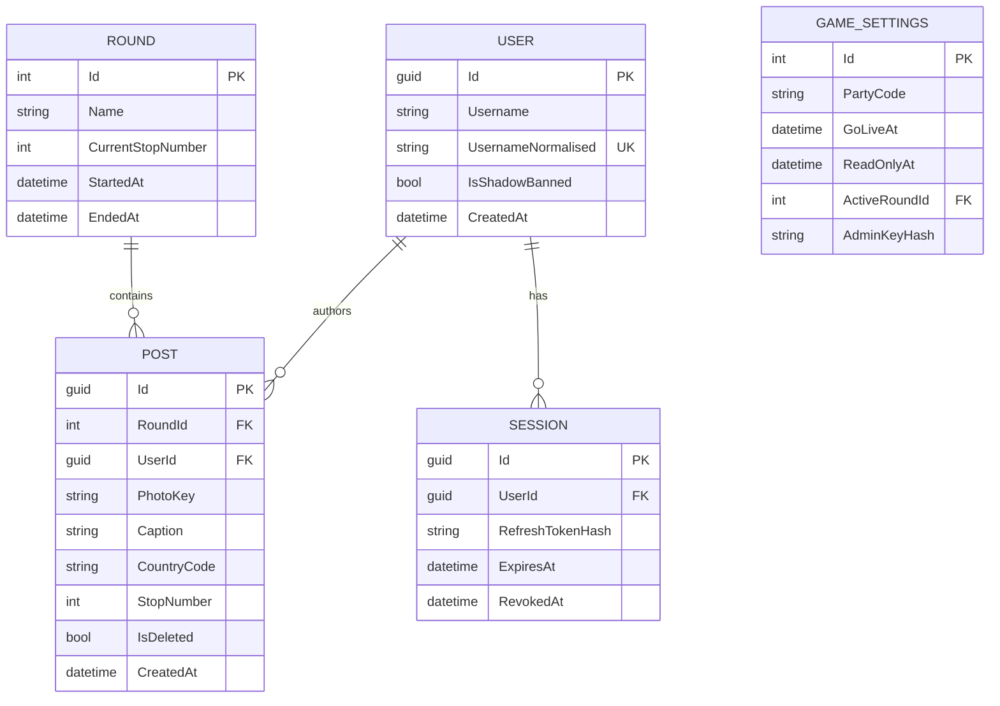

# Around the World — project spec

A one-night, mobile-only photo game for a birthday pub crawl. You drink something
from a different country at every stop, photograph it, caption it, and tag where
the drink is from. The group gets a shared chronological feed and a world map
that fills up as the night goes on.

**Live:** `balenthiran.co.uk/birthday` · **Party code:** `260802`
**Go live:** 28 Aug 2026, 17:00 BST · **Read-only:** 29 Aug 2026, 05:00 BST

---

## 1. What it is (and isn't)

| | |
|---|---|
| **For** | ~15–25 friends on one pub crawl, on their phones, mildly drunk |
| **Core loop** | Take photo → caption → pick the drink's country → it appears in the feed and on the map |
| **Success** | Everyone can post in under 15 seconds without reading instructions, and the map is full by the end of the night |
| **Lifetime** | One evening. ~100–200 posts total. Then read-only forever as a keepsake |

**Explicitly out of scope:** likes, comments, notifications, real-time updates,
desktop layout, email, password reset, profile pictures, editing a post after
posting, and any feed that isn't the current round.

### The one conceptual decision worth stating plainly

The country tag is **where the drink is from, not where the drinker is**. A
Peroni in a Wetherspoons in Clapham is *Italy*. This is the whole conceit of an
around-the-world crawl, and it has a large engineering consequence: there is no
geolocation anywhere in this app. No browser location permission, no GPS
accuracy handling, no privacy surface. Country comes from a picker.

---

## 2. Domain



### Rounds — why the "reset" isn't a delete

A reset **ends the active round and starts a new one**. Nothing is ever
truncated. Every post carries the `RoundId` it was made in, and the feed only
ever shows the active round.

This buys three things for the price of one integer column: the daily test
resets during the build week are non-destructive; the 17:00 birthday reset gives
a genuinely clean slate without a scary `DELETE`; and the night itself stays
permanently browsable afterwards instead of being wiped by the next reset.

### Soft delete everywhere

`POST.IsDeleted` is the only delete in the system. Both the author deleting
their own post and the admin removing someone else's set the same flag. Photos
are left in object storage — at a couple of hundred objects, orphan cleanup is
not worth the code.

---

## 3. Game state — three modes, zero cron jobs

Mode is **derived from the clock on every request** rather than stored, flipped
by a scheduled job, or triggered by a redeploy:

```
now < GoLiveAt                    → Practice   posting allowed, banner: "practice round"
GoLiveAt <= now < ReadOnlyAt      → Live       posting allowed, the real thing
now >= ReadOnlyAt                 → Finished   read-only, composer hidden
```

Both timestamps live in `GameSettings` and are editable from the admin page.
That is deliberately the whole mechanism: testing the 17:00 cutover means
dragging a timestamp and reloading, not waiting for a Kubernetes `CronJob` to
fire or redeploying with a new config value. It also means a mistimed birthday
is a one-tap fix from a phone in a pub, which matters more than architectural
purity here.

`Practice` allows posting on purpose — the build week needs a mode where the app
is fully usable but obviously not the real event.

---

## 4. Auth — a name, and for one person a code

No emails, no passwords, no OAuth, and since #29 **no party code either**: you
type a name and you are in. The site is only writable for the twelve hours of
the party and the link goes to people who were invited, so a code on the door
bought nothing and cost every guest a step.

The code (`260802`) survives guarding exactly one thing — **the host's name**.
Admin is granted by *username* (§ Admin below), so an open join would hand the
admin panel to whoever typed `james` first. The host's name therefore still
needs the code; nobody else's does. The field is not on the join screen: it
appears only after the API refuses a name as the host's.

```
POST /api/auth/join     { username, partyCode? } → { accessToken, refreshToken, user }
POST /api/auth/refresh  { refreshToken }         → { accessToken, refreshToken }
```

`partyCode` is optional and is **read only when `username` is the host's**. A
guest who sends one is not checked against it, so a stale value cannot lock
anyone out. Claiming the host's name without the right code is a **403**, and it
creates no user row — otherwise a failed attempt would squat the name and lock
the host out of his own party for the night.

- **Access token** — JWT, short-lived, sent as `Authorization: Bearer`.
- **Refresh token** — opaque random string, stored **hashed** in `SESSION`,
  rotated on every use with the previous one revoked.
- **Username claim** — first person to take a name owns it. A second device
  claiming a taken name is refused with a 409 rather than silently joining as
  them. The admin page can release a name when someone genuinely changes phone.

The threat model is "a friend messing about", not an attacker. What this design
actually protects is the *feed's integrity* — that a post attributed to someone
was made by the phone that claimed that name. It was never protection against
someone who wanted in; that person is invited. "A friend messing about" is
exactly why the host's name keeps a lock: the friend who would type `james` for
a laugh is the one person the threat model does predict.

### Shadow ban

`USER.IsShadowBanned` filters that user's posts out of everyone else's feed,
map counts and leaderboard — but their own feed is unchanged, so from their side
nothing happened. That is the point: no argument at the bar.

---

## 5. API contract

All routes under `/api`. Authenticated unless noted.

| Method | Route | Purpose |
|---|---|---|
| `POST` | `/auth/join` | Anonymous. Username → tokens. The host's name also needs the code |
| `POST` | `/auth/refresh` | Anonymous. Rotate token pair |
| `GET` | `/game` | Anonymous. Mode, active round, current stop, cutover timestamps |
| `GET` | `/posts` | Active-round feed, newest first. `?country=XX` filters |
| `POST` | `/posts` | Multipart: photo + caption + country code |
| `DELETE` | `/posts/{id}` | Soft delete. Author or admin |
| `GET` | `/countries` | Post count per country — powers map badges and the leaderboard |

Admin routes sit under `/api/admin` behind an admin key header:

| Method | Route | Purpose |
|---|---|---|
| `POST` | `/admin/stop/next` | Advance the pub stop by one |
| `POST` | `/admin/round` | End the active round, start a new one |
| `PUT` | `/admin/settings` | Edit go-live / read-only timestamps |
| `POST` | `/admin/users/{username}/ban` | Shadow ban / un-ban |
| `POST` | `/admin/users/{username}/release` | Release a claimed username |
| `DELETE` | `/admin/posts/{id}` | Soft delete any post |

Failures throw typed `AppException`s and surface as RFC 7807 `ProblemDetails`,
per `docs/specs/backend-architecture.md` §9.

---

## 6. Photos

Stored in **OCI Object Storage** via its S3-compatible API (`AWSSDK.S3`), behind
an `IPhotoStorage` abstraction. A `FileSystemPhotoStorage` implementation is
selected automatically when no OCI configuration is present, mirroring the
existing connection-string pattern in `ServiceRegistration` — so the app runs
locally and in tests with zero cloud credentials.

**Images are resized client-side before upload** (longest edge ~1600px, JPEG
~80%). A modern phone photo is 3–5MB; this lands it at a few hundred KB. On pub
wifi at 11pm this is the difference between the app working and the app being
abandoned, and it is a dozen lines of `<canvas>`. The server still enforces a
content-type allowlist and a max size — client-side compression is a UX measure,
not a security control.

---

## 7. The map

An SVG world map drawn from a vendored 110m TopoJSON using **`d3-geo` +
`topojson-client` directly**, rather than `react-simple-maps`.

`react-simple-maps` is a thin wrapper over exactly these two libraries, and on
React 19 it currently routes through a community fork. Rendering the geographies
ourselves is roughly forty lines — a `geoMercator` projection, a `geoPath`
generator, and a `<path>` per country — and removes a dependency whose
maintenance status is the single riskiest thing in the frontend tree for an app
that must work on one specific evening.

**Pins are aggregated, not individual.** One badge per country showing the post
count, positioned at a vendored centroid, tapping through to that country's
feed. This sidesteps the two genuinely fiddly problems — overlapping markers and
a per-marker tap target on a phone — and gives a better mobile interaction than
195 individual pins would.

Centroids are computed from the largest polygon of each country's geometry
rather than `geoCentroid`, which puts France in the Atlantic and the USA in the
Pacific because of overseas territories. Known outliers are hand-corrected in
the vendored dataset.

---

## 8. Frontend shape

Mobile-only. Bottom tab bar, four destinations:

| Tab | Screen |
|---|---|
| **Feed** | Chronological, newest first, **pub-stop divider rows** between stops |
| **Map** | World map with per-country count badges |
| **Post** | Camera capture → caption → country picker |
| **Board** | Countries ranked by post count → tap opens that country's feed |

Plus `/join` (unauthenticated) and `/admin` (hidden, unlinked, key-gated).

Data refreshes **on page load only** — no polling, no websockets. Twenty people
refreshing a feed by pulling down is entirely adequate for one evening and
removes a whole category of failure.

Styling uses the **org design system** (`docs/design-system.md`) — the
`casual` theme, light, coral on warm paper. Its token layer is vendored, so
the app inherits a visual language rather than inventing one.

> Written as *"the existing Iris design system — dark glass on near-black, one
> indigo→violet accent"*. Iris and its successor were both rejected as
> "vibe coded"; the app now wears the org system instead. Recorded rather than
> quietly overwritten, because the rejected assumption is the useful part.

---

## 9. Decisions taken

| # | Decision | Why | If wrong |
|---|---|---|---|
| 1 | Country = the drink's origin, not the user's location | It's what an around-the-world crawl *is* | Would need geolocation + permission handling — a day's work |
| 2 | Reset = new round, never a truncate | Non-destructive testing; night stays browsable | One extra FK column, no downside found |
| 3 | Game mode derived from timestamps per request | No cron, no redeploy; cutover is admin-editable from a phone | Trivial to replace with a stored flag |
| 4 | `d3-geo` directly, not `react-simple-maps` | Removes a React-19-fork dependency from the critical path | ~40 lines to swap back |
| 5 | Aggregated country badges, not per-post pins | Avoids marker overlap and tiny tap targets | Per-post pins remain possible later |
| 6 | Client-side image resize | Upload speed on pub wifi is the real constraint | Server still enforces limits regardless |
| 7 | `FileSystemPhotoStorage` fallback | Local dev and CI need no OCI credentials | Behind an interface; costs one class |
| 8 | Wear the org design system (`casual`) | Inherits a visual language instead of inventing one | Token layer is vendored, so upstream changes are a re-copy |
| 9 | Refresh on page load only | Adequate for ~20 users for one evening | Polling is a small addition if it feels stale |
| 10 | Username claim locked to first device | Keeps feed attribution honest | Admin can release a name |

---

## 10. Build order

1. Spec (this document)
2. Backend: schema, rounds, game state → `#2`
3. Backend: auth → `#3`
4. Backend: photo storage → `#4`
5. Backend: posts, aggregation, admin → `#5`
6. Frontend: shell, join, auth → `#6`
7. Frontend: feed + composer → `#7`
8. Frontend: map, country feed, leaderboard → `#8`
9. Frontend: admin page → `#9`
10. Deployment: `/birthday` path, secrets → `#10`
